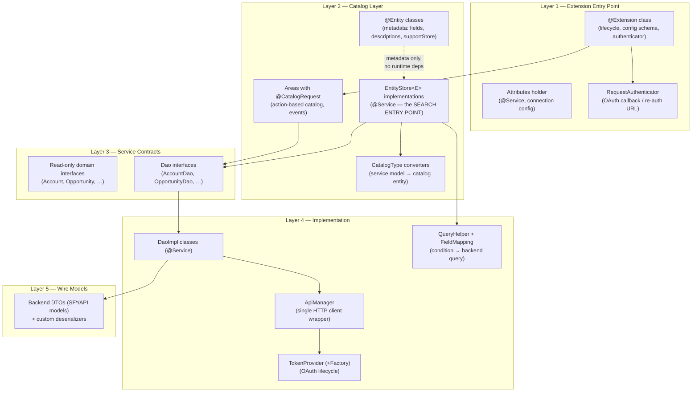
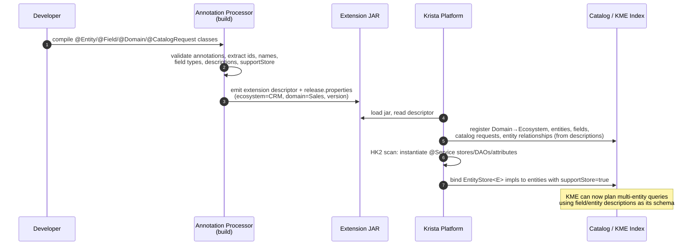
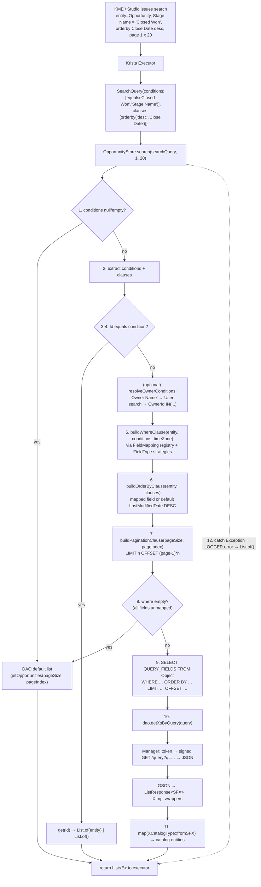
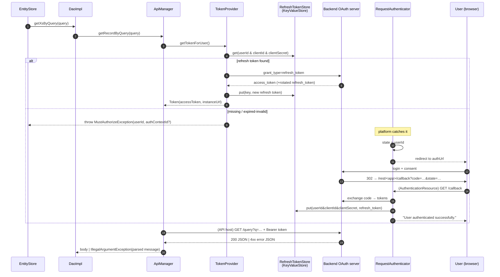
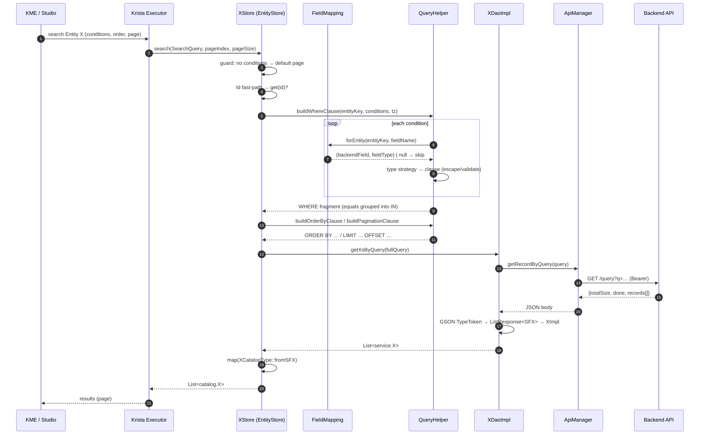
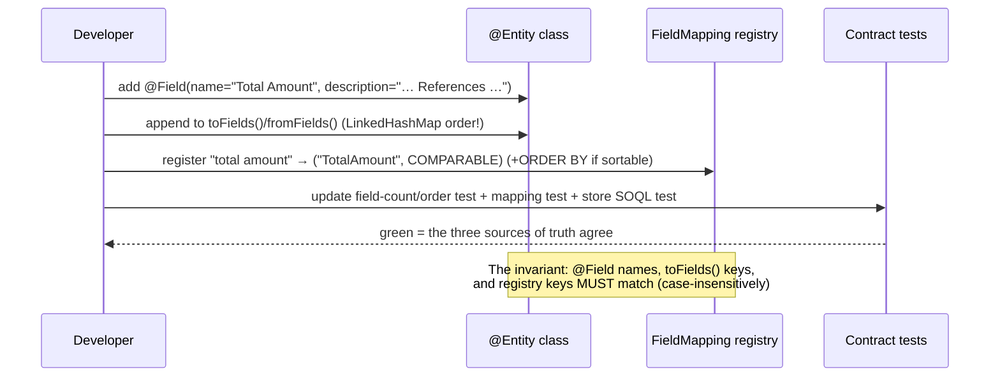
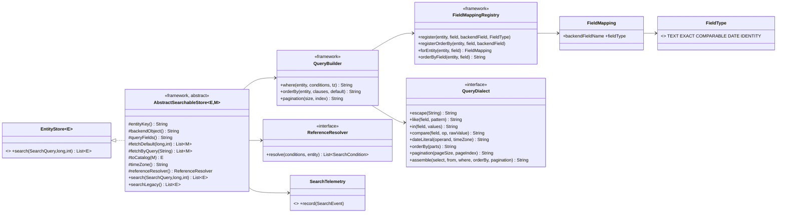

# Entity Search Implementation Skill

**The canonical implementation guide for adding KME Entity Search to any Krista catalog extension.**

> Derived by reverse-engineering the `salesforce_sales` extension (v2.0.18, the reference implementation of the `EntityStore` pattern) and the *Salesforce Sales — KME Entity Search Implementation Plan*. A developer following this guide can implement Entity Search in **any** extension (Jira, Confluence, Slack, SharePoint, Outlook, Gmail, Dynamics, ServiceNow, HubSpot, Zendesk, …) without ever reading the Salesforce source.

| | |
|---|---|
| **Audience** | Extension developers, reviewers, architects |
| **Framework contracts** | `app.krista:krista-apis` ≥ 1.0.124 (`extension-executor-api`, `extension-impl-util`, `extension-spec`) |
| **Java** | 21 |
| **DI** | HK2 (`org.jvnet.hk2.annotations.@Service` + `javax.inject.@Inject`) |
| **Status** | Canonical — all new Entity Search implementations MUST follow this guide |

---

## Table of Contents

1. [Architecture](#1-architecture)
   - 1.1 The Five Layers
   - 1.2 Framework Contracts (verified SDK signatures)
   - 1.3 File-by-File Role Map
   - 1.4 Design Pattern Catalog
2. [The Entity Search Lifecycle](#2-the-entity-search-lifecycle)
   - 2.1 Registration & Discovery
   - 2.2 Metadata & Catalog Generation
   - 2.3 The Search Request Lifecycle (end to end)
   - 2.4 Authentication & Authorization
   - 2.5 Filtering, Sorting, Pagination
   - 2.6 Error Handling, Logging, Telemetry
   - 2.7 Sequence Diagrams
3. [Generic Framework Design](#3-generic-framework-design)
   - 3.1 Generic vs Extension-Specific Split
   - 3.2 The Entity-Search Core (proposed shared SDK)
   - 3.3 Recommended Folder Structure
4. [Implementation Steps](#4-implementation-steps)
5. [Code Templates](#5-code-templates)
6. [Extension Checklist](#6-extension-checklist)
7. [Common Bugs & How to Prevent Them](#7-common-bugs--how-to-prevent-them)
8. [Best Practices](#8-best-practices)
9. [Migration Guide](#9-migration-guide)
10. [Appendix: Verified SDK Contracts](#10-appendix-verified-sdk-contracts)

---

# 1. Architecture

## 1.1 The Five Layers

Every Krista extension that supports Entity Search is organized into five layers. Each layer has exactly one responsibility and depends only on the layer beneath it.



**Why five layers?** Each answers a different question:

| Layer | Question it answers | Salesforce example | Reusable? |
|---|---|---|---|
| 1 — Entry | "How does Krista boot, configure, and authenticate this extension?" | `SalesforceSalesExtension`, `SalesforceSalesAttributes`, `SalesforceSalesRequestAuthenticator` | Pattern 100%; contents per-backend |
| 2 — Catalog | "What entities/actions does the platform see, and how are they searched?" | `catalog/entities/*`, `catalog/stores/*`, `catalog/*Area`, `catalog/catalogtypes/*` | Pattern 100%; field lists per-backend |
| 3 — Contracts | "What operations does the domain expose (mock-friendly)?" | `service/*Dao`, `service/*` | Pattern 100% |
| 4 — Impl | "How do we talk to the backend?" | `impl/*DaoImpl`, `SalesforceManager`, `util/SoqlQueryHelper`, `util/SoqlFieldMapping`, `impl/connectores/*` | Query-helper skeleton and manager skeleton reusable; syntax per-backend |
| 5 — Models | "What does the wire format look like?" | `model/SF*`, `util/*Deserializer` | Pattern reusable; shapes per-backend |

**The single most important architectural fact:** in the `EntityStore` pattern, **the store IS the entity search implementation**. There is no `EntityRequests`, no `ServiceRegistry`, no `EntityImplementationService`, and no per-entity "search provider" class. The Krista executor calls `EntityStore.search(SearchQuery, pageIndex, pageSize)` directly on the HK2-discovered `@Service` store. Do **not** build parallel infrastructure — the implementation plan for Salesforce explicitly rejected duplicating the Jira-style registry because HK2 `@Service` on stores already handles registration.

## 1.2 Framework Contracts (verified SDK signatures)

These are the exact contracts your code compiles against (decompiled from `extension-executor-api-1.0.124.jar` and `extension-impl-util-1.0.124.jar` — do not guess these, they are load-bearing):

```java
// app.krista.extension.util.EntityStore — implement one per searchable entity
public interface EntityStore<E> {
    E create(Map<String, Object> entityAttributeFields) throws IOException;
    E get(String primaryKey) throws IOException;
    E update(E entity) throws IOException;
    void delete(String primaryKey) throws IOException;
    boolean contains(String primaryKey) throws IOException;
    List<E> search(List<SearchCondition> conditions, long pageIndex, int pageSize) throws IOException; // legacy — stub it
    List<E> search(SearchQuery searchQuery, long pageIndex, int pageSize) throws IOException;          // THE entry point
    long count(List<SearchCondition> conditions) throws IOException;
    List<String> lookup(Map<String, Object> keys, List<String> fields) throws IOException;
}

// app.krista.extension.executor.SearchQuery
public class SearchQuery {
    public SearchQuery(List<SearchCondition> searchConditions, List<QueryClause> queryClauses);
    public List<SearchCondition> getSearchConditions();  // filters
    public List<QueryClause>     getQueryClauses();      // orderby etc.
}

// app.krista.extension.executor.SearchCondition — NOTE constructor order: (operator, operand, fieldName)
public class SearchCondition {
    public SearchCondition(Operator operator, Object operand, String fieldName);
    public Operator getOperator();
    public Object   getOperand();
    public String   getFieldName();
    public enum Operator { gte, lte, gt, lt, equals, startswith, endswith, contains, notequals, orderby }
}

// app.krista.extension.executor.QueryClause — same shape; Operator has only: orderby
```

Other load-bearing platform contracts (from `extension-spec` / annotation processor):

| Contract | Role in Entity Search |
|---|---|
| `@Entity(name, id, primaryKey, supportStore, description)` | Declares a searchable entity. **`supportStore = true` is the master switch** — without it, the platform never routes search to your store. `description` feeds KME/LLM entity selection: it must document cross-entity relationships. |
| `@Field` / `@Field.Text` / `@Field.PickOne` / `@Field.Date` … | Declares entity fields + types + `description` (with cross-entity references). Field `name` values are the *exact* strings that arrive in `SearchCondition.getFieldName()`. |
| `@Searchable`, `@ToString`, `@Custom` | Field/class markers: searchable in catalog, display-name field, denormalized field. |
| `@Domain(id, name, ecosystemId, ecosystemName, ecosystemVersion)` | Groups entities/areas into Domain→Ecosystem for catalog generation. |
| `@CatalogRequest(id, name, description, area, type)` | Action-based catalog (QUERY_SYSTEM / CHANGE_SYSTEM / WAIT_FOR_EVENT). Complements, does not replace, Entity Search. |
| `@Extension`, `@InvokerRequest(Type.AUTHENTICATOR \| CUSTOM_TABS \| VALIDATE_ATTRIBUTES \| TEST_CONNECTION \| INVOKER_UPDATED)` | Extension lifecycle hooks. |
| `RequestAuthenticator` | SPI for OAuth re-authorization (`getMustAuthorizeResponse` returns the auth URL). |
| `KeyValueStore` | Platform persistence used for refresh tokens and auth-context attributes. |
| HK2 `@Service` + `@Inject` | The *only* registration mechanism. A store annotated `@Service` implementing `EntityStore<E>` is discovered automatically. |

**How field names travel:** Krista Studio / KME issues a search against entity "Opportunity" field "Stage Name". The executor builds `new SearchCondition(equals, "Closed Won", "Stage Name")` and calls your store. The string `"Stage Name"` is the `@Field(name=...)` value — *not* the backend's `StageName`. Translating between the two is the entire job of the field-mapping registry.

## 1.3 File-by-File Role Map

Every file in the reference implementation, why it exists, and its reuse classification. (`GEN` = move to/generate from generic framework, `TPL` = copy-and-adapt template, `EXT` = extension-specific.)

### Layer 1 — Entry point (root + `api/`)

| File | Why it exists / problem it solves | Depends on it | Class |
|---|---|---|---|
| `SalesforceSalesExtension` | `@Extension` entry point. Declares config schema via class-level `@Field.Text/Boolean` (clientId, clientSecret, instanceUrl, username, password, securityToken, sandbox, timezone). Implements lifecycle hooks: `AUTHENTICATOR` (returns the RequestAuthenticator), `CUSTOM_TABS` (docs tab), `VALIDATE_ATTRIBUTES` (timezone + credential validation before save), `TEST_CONNECTION` (acquires a token), `INVOKER_UPDATED` (hot-reloads attributes). | Platform runtime | TPL |
| `SalesforceSalesAttributes` | `@Service` config holder. Lazy, `synchronized` construction of `OAuth20Service` (standard + custom-domain); flow auto-detection (client-credentials vs auth-code vs password grant); callback-URL derivation (`<routingUrl>/rest/<app-path>/callback`); `update()` for hot config changes; **`getTimezone()` used by stores for DATE condition conversion**. | Stores, TokenProvider, Manager | TPL |
| `SalesforceSalesRequestAuthenticator` | Implements `RequestAuthenticator`. Encodes `state = userId[#authContextId]`, generates the OAuth authorization URL in `getMustAuthorizeResponse`, extracts account id from callbacks. | Platform auth engine | TPL (OAuth pattern is generic) |
| `api/SalesforceSalesApplication` | JAX-RS `Application` (`@Service @ApplicationPath @ContractsProvided(Application.class)`) registering REST resources. | Jersey/HK2 | TPL |
| `api/AuthenticationResource` | `/callback` completes code→token exchange and persists the refresh token under key `userId&clientId&clientSecret`; `/opportunityChanged`, `/accountchanged`, `/leadchanged`, `/taskchanged` receive backend webhooks, parse XML, forward as Krista events. | Backend OAuth + webhooks | TPL (callback), EXT (webhooks) |
| `api/SalesforceCustomApi` | ScribeJava `DefaultApi20` subclass parameterizing token/authorize endpoints by custom domain (enables client-credentials against My Domain). | Attributes | TPL |

### Layer 2 — Catalog

| File(s) | Why | Class |
|---|---|---|
| `catalog/entities/*` (14) | Pure metadata classes: `@Entity` + `@Field` annotations + `toFields()`/`fromFields()` using **`LinkedHashMap` to preserve field order** (the platform relies on stable ordering). 12 have `supportStore = true`; `LatestPosts` and `SalesPipelineSummary` stay `false` (feed/aggregate entities that cannot be queried record-wise). Descriptions document every cross-entity relationship ("Owner Id references User.Id"). | TPL |
| `catalog/stores/*` (12) | **The Entity Search implementations.** `@Service` classes implementing `EntityStore<E>`, one per searchable entity. All follow the identical 12-step template (§2.3). | TPL (template is GEN-able) |
| `catalog/catalogtypes/*` (13 + aggregator) | Static converter classes `XCatalogType.fromSFX(service.X) → catalog.X`; a few add null-safe `toMap()` for create/update. Decouple wire/service models from catalog contracts. | TPL |
| `catalog/*Area` (12) | Action catalog: `@CatalogRequest` methods (QUERY_SYSTEM / CHANGE_SYSTEM / WAIT_FOR_EVENT) with `@Field` parameters, DAO constructor injection. Orthogonal to Entity Search but shares DAOs. | TPL/EXT |

### Layer 3 — Service contracts (`service/`)

| File(s) | Why | Class |
|---|---|---|
| `*Dao` interfaces (16) | Mockable data-access contracts (`getXById`, `getXs(size,page)`, `getXsByQuery(query)`, `addX(map)`, `updateX`, `deleteX`). The `getXsByQuery(String)` method is what stores call with the built query. | TPL |
| Domain interfaces (`Account`, `User`, …) | Read-only getter views over wire models (immutability at the API boundary; `UserImpl(SFUser)` etc. wrap them). | TPL |

### Layer 4 — Implementation (`impl/`, `util/`)

| File | Why | Class |
|---|---|---|
| `SalesforceManager` | The single HTTP gateway: URL construction (`/services/data/vXX.X/query?q=…`), Bearer-token header injection, ScribeJava execution, ≥400 → `IllegalArgumentException` with parsed backend error message, `getDifference()` reflection diff for PATCH updates. | TPL (skeleton GEN-able) |
| `impl/*DaoImpl` (16) | One per entity: builds/receives query, calls Manager, GSON-deserializes `SalesforceListResponse<SF*>` via `TypeToken`, wraps in `*Impl`. Exposes the `QUERY_FIELDS` constant reused by stores. `UserDaoImpl.getUsersByQuery` powers owner-name resolution. | TPL |
| `impl/connectores/SalesforceTokenProvider(+Factory)` | OAuth lifecycle: refresh-token lookup (`RefreshTokenStore`) → refresh; client-credentials for custom domain; password grant fallback; `MustAuthorizeException` with user details when re-auth needed; contextual error messages per OAuth error code. Factory creates per-attribute-set providers (multi-tenant). | TPL |
| `impl/stores/RefreshTokenStore` | `KeyValueStore` wrapper persisting refresh tokens (`put/get/deleteSession`). | GEN |
| `impl/stores/SalesforceSaleAttributeStore` | Persists per-auth-context config (clientId/secret/sandbox) under a UUID for the OAuth state round-trip. | GEN |
| `impl/stores/KristaMediaClient`, `ContentDaoImpl` | File bridge to Krista `FileRepository` (zip-wraps unsupported formats); JSON→FreeForm parsing. Not part of Entity Search. | GEN/EXT |
| `util/SoqlFieldMapping` | **The field-mapping registry** — single source of truth: `entity(lower) → field(lower) → (backendFieldName, FieldType)` + a separate ORDER-BY map. `FieldType ∈ {TEXT, EXACT, COMPARABLE, DATE, IDENTITY}`. Null-returning lookups; unknown fields are skipped, never errors. | TPL (structure GEN) |
| `util/SoqlQueryHelper` | **The query builder** — stateless static methods: `buildWhereClause(entity, conditions[, timeZone])`, `buildOrderByClause(entity, clauses)`, `buildPaginationClause(pageSize, pageIndex)`, `resolveOwnerConditions(conditions, entity, userDao)`. Groups repeated `equals` into `IN (…)`, validates COMPARABLE/DATE operands by regex (injection defense for unquoted values), escapes TEXT/EXACT/IDENTITY values, converts epoch-millis→`yyyy-MM-dd` with timezone. | TPL (skeleton GEN) |
| `util/DatePlus` | Date formatting: SOQL `yyyy-MM-dd`, ISO-8601 UTC, epoch conversion with timezone. | GEN |
| `util/SFHelper` | `soqlEscape()` (backslash + quote escaping) + flow selection + FreeForm mapping helpers. | TPL |
| `util/CustomFieldsExtractor` / `CustomFieldsSerializer` | Normalize user field names to backend custom-field convention (`PO Number` → `PO_Number__c`, fix `_c` → `__c`); flatten `customFields` map to JSON root on create/update. | TPL (pattern GEN) |
| `util/OpportunityQueryBuilder`, `TaskQueryBuilder` | **Legacy** per-entity query builders (inline string concat / fluent builder). Superseded by `SoqlFieldMapping` + `SoqlQueryHelper`. Do NOT copy this pattern into new extensions. | deprecated |
| `util/Validators`, `util/Constants` | Input validation (timezone against `TimeZone.getAvailableIDs()`, email fields) and centralized constants/error templates. | TPL |
| `util/SalesforceListResponse<T>` | Generic paginated list DTO (`totalSize`, `done`, `records`). | GEN |
| `util/SF*Deserializer` | GSON deserializers that split standard fields from dynamic custom fields into `customFields` map. | TPL (pattern GEN) |
| `util/xmlparser/**` | JAXB models for backend SOAP outbound messages (webhooks), XXE-hardened (`SUPPORT_DTD=false`, no external entities). Not part of Entity Search. | EXT |

### Layer 5 — Wire models (`model/`)

| File(s) | Why | Class |
|---|---|---|
| `SF*` DTOs (20+) | Exact wire-shape mirrors with `@SerializedName`; static `from(Map)` / `from(domain)` converters for create/update; `customFields` map for dynamic fields. | TPL |
| `Me`, `OwnerResponse`, `Quota`, aggregates | Endpoint-specific response shapes for reporting/feed APIs. | EXT |

## 1.4 Design Pattern Catalog

Patterns actually present in the reference implementation, why they were chosen, and how to reuse them.

| # | Pattern | Where | Why it exists | Benefits | Alternatives considered / rejected | How to reuse |
|---|---|---|---|---|---|---|
| 1 | **Registry** | `SoqlFieldMapping` static maps | One source of truth for entity→field→(backend name, type); kills scattered per-store `if("Owner Id".equals(...))` chains | O(1) case-insensitive lookup; adding a field = one line; testable in isolation | Per-store inline mapping (the pre-refactor state — drifted, inconsistent operators); annotation-driven mapping (needs processor work) | Copy the two-map structure; replace contents. Long-term: build from `@SearchField` annotations (§3.2) |
| 2 | **Template Method (implicit)** | All 12 stores' `search()` | Every store runs the identical 12-step sequence; only entity name, QUERY_FIELDS, DAO call, and mapper differ | Uniform behavior, predictable review, trivially explained | Explicit abstract base class — *the better form*; the plan kept stores flat to avoid churn, but new code should use `AbstractSearchableStore` (§5.3) | Extend the abstract base template so the sequence is enforced by the compiler, not by convention |
| 3 | **Strategy** | `FieldType` → clause builder dispatch in `SoqlQueryHelper` (`buildTextClause`, `buildExactClause`, `buildComparableClause`, `buildDateClause`, `buildIdentityClause`) | Operator semantics differ per field type (TEXT gets LIKE; COMPARABLE gets unquoted comparisons; DATE gets format conversion) | New field type = one new branch + tests; injection defense localized per strategy | One giant switch over (type × operator) — unreadable; polymorphic FieldType classes — fine, more ceremony | Keep the five types; they map cleanly onto JQL/CQL/OData/KQL semantics too |
| 4 | **Adapter / Converter** | `*CatalogType.fromSFX`, `*Impl(SF*)`, `SFX.from(Map)` | Three representations (wire DTO, service view, catalog entity) must stay decoupled so backend API drift never leaks into catalog contracts | Catalog schema is stable; wire models can change freely; conversions unit-testable | Single shared class for all three roles — couples catalog to wire format, breaks on API version bumps | One `XCatalogType` per entity, static factory naming `fromSFX`/`toMap` |
| 5 | **Factory** | `SalesforceTokenProviderFactory`, `SalesforceSalesAttributes.create(...)`, static entity factories | Token providers are per-attribute-set (multi-tenant/auth-context); entities built from field maps | Supports context-specific credentials; keeps constructors simple | Direct `new` in call sites — loses multi-tenant support | Keep the factory for token providers; keep `create(...)`/`fromFields(...)` statics |
| 6 | **Facade** | `SalesforceManager` | One place for URL building, auth header injection, error translation | DAOs contain zero HTTP code; swap API version in one file; single mock point in DAO tests | Per-DAO HTTP clients — duplicated auth/error logic | `<Backend>ApiManager` per extension; identical public surface (`getRecordById/ByQuery, createRecord, updateRecord, deleteRecordById`) |
| 7 | **Interface/Impl split + DI** | `service/*Dao` ↔ `impl/*DaoImpl`, HK2 `@Service`/`@Inject` | Mockability and swap-ability; HK2 auto-binds by type — *this replaces any hand-rolled ServiceRegistry* | Store tests mock the DAO; DAO tests mock the Manager; zero registration code | Manual registry classes (Jira-legacy style) — explicitly rejected in the implementation plan as duplicate infrastructure | Every DAO gets an interface; every impl gets `@Service`; constructor injection only, fields `private final` |
| 8 | **Builder** | `TaskQueryBuilder` (fluent, legacy) | Readable chained condition assembly | Readability | Superseded — the type-aware helper is strictly better | Don't reuse for search; acceptable for complex non-search report queries |
| 9 | **Null-object / graceful degradation** | Unknown field → skip condition; failed search → `List.of()`; unmapped ORDER BY → default sort | A partially-serviceable search is more useful to KME than a hard failure | Robust to KME issuing conditions on non-searchable fields | Fail-fast — would break mixed-field queries. Trade-off: silent skips must be logged (see §7 bug #9) | Keep skip-and-log semantics |
| 10 | **Fast-path optimization** | Id short-circuit in every `search()` | `Id equals` lookups are the most common KME probe; a `GET /sobjects/{id}` beats a query | Lower latency + API-quota cost | Running Id through the query pipeline — works, wasteful | Always check for an `Id`/primary-key `equals` condition first and delegate to `get()` |
| 11 | **Token Provider SPI** | `SalesforceTokenProvider` + `RefreshTokenStore` | Encapsulates all three OAuth flows + refresh + `MustAuthorizeException` signaling | Stores/DAOs never see auth; re-auth is a platform-level redirect | Auth inline in Manager — untestable, single-flow | Same provider shape for any OAuth backend; key refresh tokens by `userId&clientId&clientSecret` |

---

# 2. The Entity Search Lifecycle

## 2.1 Registration & Discovery

There is **no runtime registration code**. Registration happens in three build/boot mechanisms:

1. **Build time — annotation processor** (`app.krista:extension-impl-anno-processors`): scans `@Extension`, `@Entity`, `@Field`, `@Domain`, `@CatalogRequest` and emits descriptor metadata into the jar. This descriptor is the *catalog* the platform reads — entity names, field schemas, descriptions, `supportStore` flags, domain/ecosystem grouping.
2. **Boot time — HK2 discovery**: the platform scans the jar for `@Service` classes and instantiates them with constructor injection. A store `@Service class OpportunityStore implements EntityStore<Opportunity>` is thereby *bound as the search implementation for the `Opportunity` entity* — the generic type parameter + entity metadata make the association.
3. **Boot time — extension lifecycle**: the platform instantiates the `@Extension` class, calls `@InvokerRequest(AUTHENTICATOR)` to obtain the `RequestAuthenticator`, registers the JAX-RS `Application` under its `@ApplicationPath`, and exposes catalog metadata to Studio/KME.

**Entity discovery rule:** an entity is *search-discoverable* iff:
- `@Entity(supportStore = true)`, and
- an HK2 `@Service` class implementing `EntityStore<ThatEntity>` exists, and
- the entity and its fields carry descriptions rich enough for KME to select it (relationship text like "Contains Orders where Order.Account Id matches Account.Id").

## 2.2 Metadata & Catalog Generation



Key consequences:
- **Descriptions are functional, not cosmetic.** KME plans joins from prose ("Owner Id references User.Id"). Missing descriptions = wrong or failed entity selection.
- **Field `name` strings are the search API.** Renaming `@Field(name="Stage Name")` silently breaks any mapping keyed on `"stage name"`.
- Version/domain/ecosystem metadata is extracted into `release.properties` by a Gradle task that parses the annotations — keep annotation values literal (no computed constants) so the build-time regex extraction works.

## 2.3 The Search Request Lifecycle (end to end)

The complete path of one search request, with the canonical 12-step store algorithm at its heart:



The **12-step canonical sequence** every store follows (memorize this — it is the whole pattern):

```
 1. GUARD          conditions null/empty → return DAO default page
 2. EXTRACT        conditions = q.getSearchConditions(); clauses = q.getQueryClauses()
 3. TRY            open the catch-all block
 4. ID FAST-PATH   "Id" equals condition → get(id) → return singleton/empty list
 (4b. RESOLVE      user-name conditions → id conditions, for entities with Owner/Assignee)
 5. WHERE          QueryHelper.buildWhereClause(entityKey, conditions[, timeZone])
 6. ORDER BY       QueryHelper.buildOrderByClause(entityKey, clauses)
 7. PAGINATION     QueryHelper.buildPaginationClause(pageSize, pageIndex)
 8. EMPTY-WHERE    where.isEmpty() → return DAO default page (all fields were unmapped)
 9. ASSEMBLE       SELECT <QUERY_FIELDS> FROM <BackendObject> WHERE <where><orderBy><pagination>
10. EXECUTE        dao.getXsByQuery(query)
11. MAP            .stream().map(XCatalogType::fromSFX).collect(toList())
12. CATCH          Exception → LOGGER.error(msg, e) → return List.of()
```

## 2.4 Authentication & Authorization

Entity Search never touches auth directly — it flows through the token provider chain:



Flow selection (auto-detect, reusable decision tree):
- **Custom domain / instance URL configured** → Client Credentials (server-to-server).
- **Username + password + security token all present** → Password Grant (service account).
- **Otherwise** → Authorization Code with refresh-token persistence (per-user delegation; `invokeAsUser()` decides user vs admin identity).

**Permission validation** is delegated to the backend: the store sends the query under the caller's token; the backend enforces record-level security and returns only visible rows. The extension's job is (a) correct identity selection (`invokeAsUser`), (b) `MustAuthorizeException` when there is no valid token, and (c) never widening scope (no admin-token fallback for user searches).

## 2.5 Filtering, Sorting, Pagination

**Filtering — operator × field-type contract** (implement exactly this matrix):

| FieldType | equals | notequals | contains | startswith | endswith | gt / lt / gte / lte | Multi-value equals |
|---|---|---|---|---|---|---|---|
| TEXT | `= 'v'` | `!= 'v'` | `LIKE '%v%'` | `LIKE 'v%'` | `LIKE '%v'` | — | — |
| EXACT | grouped → `=`/`IN` | grouped → `!=`/`NOT IN` | fallback to `=` | — | — | — | `IN ('a','b')` |
| COMPARABLE | `= v` | `!= v` | — | — | — | `> < >= <=` (unquoted, **numeric-regex validated**) | — |
| DATE | `= d` | `!= d` | — | — | — | `> < >= <=` (epoch→`yyyy-MM-dd` in org timezone, **date-regex validated**) | — |
| IDENTITY | grouped → `=`/`IN` | grouped → `NOT IN` | — | — | — | — | `IN (…)` |

Injection defense is *type-specific*: quoted types (TEXT/EXACT/IDENTITY) get escaping (`\` → `\\`, `'` → `\'`); unquoted types (COMPARABLE/DATE) get strict format validation and are **dropped** if invalid (`"0 OR 1=1"` produces no clause). All clauses join with `AND`.

**Sorting:** `orderby` arrives both as a `SearchCondition` (skip it in WHERE building!) and as a `QueryClause`. Only fields present in the ORDER-BY registry are sortable; direction parses `asc|desc|ascending|descending` (default DESC). No mapped clause → entity default (`LastModifiedDate DESC`, or `CreatedDate DESC` for objects lacking LastModifiedDate).

**Pagination:** offset-based, **1-indexed pages**: `LIMIT pageSize OFFSET max((pageIndex-1)*pageSize, 0)`. Guard negative offsets. Note the known trade-off: OFFSET pagination degrades on very deep pages (Salesforce caps OFFSET at 2000) — acceptable for KME-style interactive search; document the cap for your backend.

## 2.6 Error Handling, Logging, Telemetry

Layered error contract:

| Layer | On bad input | On backend error | Rationale |
|---|---|---|---|
| Store `search()` | skip unmappable conditions; empty WHERE → default listing | catch `Exception` → `LOGGER.error(msg, e)` → `List.of()` | search must degrade, never crash a KME plan |
| Store `create/get/update` | log + return null/empty entity | catch `IllegalArgumentException` → log → null | mutation errors surfaced by Areas with friendly text |
| Store `delete` | **throw** `IllegalArgumentException` (destructive ops fail loud) | propagate | deletes must not silently no-op |
| DaoImpl | — | propagate Manager exceptions | thin layer |
| Manager | — | HTTP ≥400 → parse backend error JSON → `IllegalArgumentException("Request failed… Error details: <message>")` | one translation point; user-actionable text |
| TokenProvider | — | no/expired token → `MustAuthorizeException`; per-error-code guidance strings (invalid_client vs invalid_grant) | drives platform re-auth redirect |

Logging pattern (SLF4J): `private static final Logger LOGGER = LoggerFactory.getLogger(X.class)`; `info` for validation misses, `error(msg, cause)` for failures; **never log tokens, secrets, or full auth headers**; log generated queries at `debug` only (they may embed user data). `log4j2.xml`: root INFO, `app.krista.extensions` ERROR.

Telemetry in the reference implementation is limited to logs + platform-level request auditing (`extension-executor-audit`). The framework design (§3) adds an explicit `SearchTelemetry` seam — record `(entity, conditionCount, mappedConditionCount, droppedConditions, resultCount, latencyMs, outcome)` per search; this is the minimum needed to detect silent-skip regressions in production.

## 2.7 Sequence Diagrams

**Entity Search (full stack):**



**Catalog generation** — see §2.2 diagram. **Authentication** — see §2.4 diagram.

**Metadata generation (developer loop):**



---

# 3. Generic Framework Design

## 3.1 Generic vs Extension-Specific Split

The rule for the split: **anything that mentions the backend's query language, object names, field names, endpoints, or auth quirks is extension-specific; everything else is framework.**

| Concern | Generic framework (`entity-search-core`) | Extension-specific |
|---|---|---|
| Search algorithm | `AbstractSearchableStore<E,M>` — the 12-step template | entity key, QUERY_FIELDS, DAO call, mapper |
| Field metadata | `FieldType` enum, `FieldMapping` value type, `FieldMappingRegistry` structure + case-insensitive lookup | the registered entity/field rows |
| Query building | operator×type matrix, equals→IN grouping, numeric/date validators, orderby extraction, offset math | `QueryDialect` impl: SOQL / JQL / CQL / OData / KQL syntax, escaping, date literals |
| Name→id resolution | `ReferenceResolver` contract (name field → id field via lookup search) | which fields ("Owner Name"), which lookup DAO |
| Pagination | 1-indexed offset contract + guards | backend caps (SOQL OFFSET ≤ 2000, Jira startAt, OData $skip) |
| Auth | OAuth2 token provider skeleton, refresh-token store, `state=userId#ctx` codec, callback resource skeleton | endpoints (`DefaultApi20` subclass), flow quirks, error-code messages |
| HTTP | Manager skeleton (sign, execute, ≥400→friendly error) | base URLs, API version, endpoint paths, error JSON shape |
| Wire parsing | `ListResponse<T>`, custom-field deserializer pattern | DTO fields, custom-field convention (`__c` vs none) |
| Errors/logging/telemetry | error contract, `SearchTelemetry` interface | messages mentioning backend concepts |
| Testing | contract test kit (store/mapping/query assertions) | fixtures per entity |

## 3.2 The Entity-Search Core (proposed shared SDK)

A single new Gradle module, `app.krista.extensions:entity-search-core`, containing ~10 small types. Every extension then writes only: entities, a dialect, a registry filler, DAOs/Manager, and one thin store subclass per entity. **Until the shared module ships, vendor this package into your extension under `<ext>.search.core` — identical code, zero behavior difference; swap the import when the module is published.**



Dialect examples proving the abstraction holds:

| `QueryDialect` op | Salesforce (SOQL) | Jira (JQL) | Confluence (CQL) | Dynamics/SharePoint (OData) | Zendesk |
|---|---|---|---|---|---|
| `like(f,"%v%")` | `f LIKE '%v%'` | `f ~ "v"` | `f ~ "v"` | `contains(f,'v')` | `f:*v*` |
| `in(f,[a,b])` | `f IN ('a','b')` | `f in ("a","b")` | `f in ("a","b")` | `f eq 'a' or f eq 'b'` | `f:a f:b` |
| `compare(f,gt,5)` | `f > 5` | `f > 5` | — | `f gt 5` | `f>5` |
| `dateLiteral` | `2026-03-15` | `"2026/03/15"` | `"2026-03-15"` | `2026-03-15T00:00:00Z` | `2026-03-15` |
| `pagination(20,2)` | `LIMIT 20 OFFSET 20` | `startAt=20&maxResults=20` (params, not query text) | `limit 20 start 20` | `$top=20&$skip=20` | `page=2` |

> Note: for parameter-based backends (Jira/Zendesk), `pagination()` returns `""` and the store passes page/size straight to the DAO — the template supports both because assembly is dialect-owned.

## 3.3 Recommended Folder Structure

```
<extension>/
├── build.gradle                      # java 21, krista-apis + anno-processor, jacoco/sonar
├── release.properties                # generated: ecosystem/domain/version/name
├── docs/Architecture.md
└── src/
    ├── main/java/app/krista/extensions/<eco>/<domain>/<ext>/
    │   ├── <Ext>Extension.java             # @Extension + lifecycle hooks
    │   ├── <Ext>Attributes.java            # @Service config holder (+timezone)
    │   ├── <Ext>RequestAuthenticator.java  # OAuth re-auth SPI
    │   ├── api/
    │   │   ├── <Ext>Application.java       # JAX-RS app (@ApplicationPath)
    │   │   ├── AuthenticationResource.java # /callback (+ webhooks)
    │   │   └── <Ext>CustomApi.java         # DefaultApi20 subclass (if OAuth)
    │   ├── catalog/
    │   │   ├── entities/                   # @Entity metadata classes ONLY
    │   │   ├── stores/                     # EntityStore impls (search entry points)
    │   │   ├── catalogtypes/               # service→catalog converters
    │   │   └── <Feature>Area.java          # @CatalogRequest actions
    │   ├── service/                        # Dao + read-only domain interfaces
    │   ├── impl/
    │   │   ├── <X>DaoImpl.java             # @Service DAO impls (own QUERY_FIELDS)
    │   │   ├── <X>Impl.java                # domain-interface wrappers over DTOs
    │   │   ├── <Backend>ApiManager.java    # single HTTP facade
    │   │   ├── connectors/                 # TokenProvider + Factory   [sic: not "connectores"]
    │   │   └── stores/                     # RefreshTokenStore, AttributeStore
    │   ├── model/                          # wire DTOs + deserializers
    │   ├── search/                         # ★ Entity Search kit
    │   │   ├── core/                       # vendored framework (until shared module ships):
    │   │   │   ├── FieldType.java          #   AbstractSearchableStore, QueryBuilder,
    │   │   │   ├── FieldMapping.java       #   FieldMappingRegistry, QueryDialect,
    │   │   │   ├── FieldMappingRegistry.java # ReferenceResolver, SearchTelemetry
    │   │   │   ├── QueryDialect.java
    │   │   │   ├── QueryBuilder.java
    │   │   │   ├── AbstractSearchableStore.java
    │   │   │   ├── ReferenceResolver.java
    │   │   │   └── SearchTelemetry.java
    │   │   ├── <Backend>Dialect.java       # SOQL/JQL/OData syntax
    │   │   ├── <Ext>FieldMappings.java     # registry contents (one line per field)
    │   │   └── OwnerReferenceResolver.java # name→id resolution (if applicable)
    │   └── util/                           # dates, validators, constants, custom-fields
    └── test/java/…                         # mirrors main; see §4 step 9
```

Rules: entities never import impl/model; stores depend only on `service/` interfaces + `search/` + catalogtypes; only `impl/` knows HTTP; only `model/` knows wire JSON; only the dialect knows query syntax.

---

# 4. Implementation Steps

Follow the steps **in order** — each is independently reviewable/shippable, and later steps depend on earlier invariants.

### Step 0 — Prerequisites & inventory
**Purpose:** know your backend before writing code.
**Do:** enumerate (a) entities to expose and their backend object names; (b) per entity: searchable fields, backend field names, natural `FieldType` for each, sortable fields, default sort; (c) the query mechanism (language vs parameters) and its pagination model + caps; (d) auth flows supported; (e) rate limits; (f) the entity relationship graph (who references whom, by which field).
**Output:** a mapping table exactly like the plan's *"Entity Field / Backend Field / Type"* table. This table **is** the spec for steps 3–5.
**Validation:** every relationship in the graph appears in at least two descriptions (both ends).

### Step 1 — Extension skeleton & auth (skip if extension exists)
**Purpose:** bootable, authenticatable extension.
**Classes:** `<Ext>Extension`, `<Ext>Attributes`, `<Ext>RequestAuthenticator`, `api/` trio, `connectors/` token provider + factory, `RefreshTokenStore`.
**Configuration:** class-level `@Field.Text(...)` config schema; secured fields (`isSecured=true`) for secrets; timezone attribute if the backend stores dates in an org timezone.
**Validation:** `VALIDATE_ATTRIBUTES` must reject bad timezone/credentials *before* save; `TEST_CONNECTION` must acquire a real token.
**Error handling:** token provider throws `MustAuthorizeException` (never returns null); per-OAuth-error-code guidance messages.
**Testing:** attributes flow-detection tests; authenticator state-codec tests.

### Step 2 — Entities & metadata (P0 — pure annotations, no logic)
**Purpose:** make entities discoverable and KME-plannable.
**Do:** for each entity: `@Entity(name, id, primaryKey="Id", supportStore=true, description=<relationship prose>)`; every `@Field` gets a `description` (reference fields MUST say "References X.Y" / "Matches X.Y"); `@Searchable` on searchable fields, `@ToString` on the display field; `toFields()` with `LinkedHashMap` in declaration order; `fromFields()` static factory with null guards. Keep aggregate/feed entities `supportStore=false` — they have no record-wise query semantics.
**Validation:** annotation processor compiles; field-count/order tests updated.
**Testing:** one `toFields()` test per entity asserting count, order, and null handling (`SmallEntitiesTest` style).

### Step 3 — Field-mapping registry (P1 — one file)
**Purpose:** centralize entity-field → backend-field + type; kill inline per-store mapping.
**Classes:** `<Ext>FieldMappings` populating `FieldMappingRegistry` (or the static-map `SoqlFieldMapping` shape if not using the core kit). Register ORDER-BY fields separately — sortable is a *subset* of searchable.
**Rules:** keys lowercase; registry lookups return null for unknowns (callers skip); custom fields registered with their backend convention (`ACV__c`).
**Testing:** one test per entity asserting every field from the Step-0 table maps to the right backend name and type; case-insensitivity; unknown → null.

### Step 4 — Dialect & query builder (P1)
**Purpose:** turn conditions into safe backend queries.
**Classes:** `<Backend>Dialect` (escape, like, in, compare, dateLiteral, orderBy, pagination, assemble) + the shared `QueryBuilder` (or `SoqlQueryHelper` shape).
**Must implement:** the full operator×type matrix (§2.5); equals/notequals grouping into IN/NOT IN; numeric regex `^-?\d+(\.\d+)?$` and date-format validation for unquoted values (drop invalid); epoch-millis→date-literal conversion honoring org timezone; orderby extraction from `QueryClause` (and **skipping** `orderby` `SearchCondition`s in WHERE); default sort per entity; `max((pageIndex-1)*pageSize, 0)` offset.
**Error handling:** builder never throws for bad conditions — it skips and (framework version) reports dropped conditions.
**Testing:** the largest suite in the extension (~60 cases): every type × operator; injection attempts rejected (`"0 OR 1=1"`, `"'; DROP"`); multi-value IN; timezone conversion; scientific-notation epochs (`1.710511845E12`); direction parsing; empty/null conditions.

### Step 5 — DAOs & Manager (extend as needed)
**Purpose:** execute queries.
**Classes:** per entity: `XDao` interface (`getXById`, `getXs(size,page)`, `getXsByQuery(query)`) + `@Service XDaoImpl`; one `<Backend>ApiManager`.
**Rules:** `QUERY_FIELDS` constant lives in the DaoImpl and is reused by the store — select every field the entity's `toFields()` needs, in one place; Manager converts HTTP ≥400 into `IllegalArgumentException` with the parsed backend message; DAO does deserialization only.
**Testing:** mock Manager, assert deserialization + argument passing.

### Step 6 — Stores (P1 — the search entry points)
**Purpose:** implement `EntityStore<E>.search(SearchQuery, long, int)` for every `supportStore=true` entity.
**Classes:** one `@Service XStore` per entity — subclass `AbstractSearchableStore` (preferred) or follow the 12-step template verbatim.
**Rules:** Id fast-path always; timezone injected via Attributes for entities with DATE conditions; legacy `search(List<SearchCondition>,…)` returns `List.of()` (never null); `contains`/`count`/`lookup` stubs return `false`/`0`/`List.of()` unless genuinely implemented; `delete` throws on blank key.
**Testing:** per store: mock DAO, capture the query string, assert fragments (`verify(dao).getXsByQuery(contains("Name LIKE '%Acme%'"))`); Id fast-path bypasses query; exception → empty list.

### Step 7 — Reference (owner-name) resolution (P2)
**Purpose:** let users search "Owner Name = Jane" when the backend stores only ids.
**Classes:** `OwnerReferenceResolver` (or `resolveOwnerConditions` helper) — detect name-fields (`owner name`, `assigned to name`), search the User store/DAO, replace with id `equals` conditions (grouping handles multi-match → IN). Zero matches → leave the original condition (yields empty result, which is correct).
**Testing:** single match → `OwnerId = 'id'`; multi-match → IN; lookup failure → condition passes through unchanged; no name-conditions → resolver is a no-op.

### Step 8 — Dynamic ORDER BY + defaults (P2)
Wire `QueryClause` orderby through the registry; verify every entity's default sort field actually exists on the backend object (`LastModifiedDate` vs `CreatedDate` class of bugs).

### Step 9 — Tests (P2 but non-negotiable before merge)
Complete the pyramid: entity `toFields()` tests · registry tests · dialect/builder tests · store query-fragment tests · resolver tests · date-conversion tests. Target: every row of the Step-0 mapping table is exercised by at least one assertion.

### Step 10 — Documentation & release
Update `docs/` per the documentation guidelines (every entity page lists searchable fields, operators, sort fields); bump `@Extension(version)`; changelog entry; regenerate `release.properties`.

---

# 5. Code Templates

Generic, copy-ready templates. `<Ext>`/`<Backend>`/`<X>` are placeholders. All templates compile against the verified SDK contracts in §10.

## 5.1 Framework kit — `search/core/` (write once, reuse everywhere)

```java
// FieldType.java
public enum FieldType {
    /** free text — supports contains/startswith/endswith/equals/notequals */
    TEXT,
    /** enumerated/exact values (status, ids-as-filters) — equals/notequals, grouped into IN/NOT IN */
    EXACT,
    /** numeric — equals/notequals/gt/lt/gte/lte, UNQUOTED + numeric-validated */
    COMPARABLE,
    /** date/datetime — comparison operators, converted to backend date literal in org timezone */
    DATE,
    /** primary/foreign keys — equals/notequals, grouped into IN/NOT IN */
    IDENTITY
}

// FieldMapping.java
public final class FieldMapping {
    private final String backendFieldName;
    private final FieldType fieldType;
    public FieldMapping(String backendFieldName, FieldType fieldType) {
        this.backendFieldName = backendFieldName;
        this.fieldType = fieldType;
    }
    public String getBackendFieldName() { return backendFieldName; }
    public FieldType getFieldType() { return fieldType; }
}
```

```java
// FieldMappingRegistry.java — instance-based (injectable, testable); the static-map
// SoqlFieldMapping shape is an acceptable equivalent for a single-backend extension.
public final class FieldMappingRegistry {
    private final Map<String, Map<String, FieldMapping>> fields = new LinkedHashMap<>();
    private final Map<String, Map<String, String>> orderBy = new LinkedHashMap<>();

    public FieldMappingRegistry register(String entity, String field, String backendField, FieldType type) {
        fields.computeIfAbsent(key(entity), k -> new LinkedHashMap<>())
              .put(key(field), new FieldMapping(backendField, type));
        return this; // fluent registration
    }
    public FieldMappingRegistry registerOrderBy(String entity, String field, String backendField) {
        orderBy.computeIfAbsent(key(entity), k -> new LinkedHashMap<>()).put(key(field), backendField);
        return this;
    }
    /** @return mapping or null — callers MUST skip null (unknown field is not an error) */
    public FieldMapping forEntity(String entity, String field) {
        if (entity == null || field == null) return null;
        Map<String, FieldMapping> m = fields.get(key(entity));
        return m == null ? null : m.get(key(field));
    }
    public String orderByField(String entity, String field) {
        if (entity == null || field == null) return null;
        Map<String, String> m = orderBy.get(key(entity));
        return m == null ? null : m.get(key(field));
    }
    private static String key(String s) { return s.toLowerCase(Locale.ROOT); }
}
```

```java
// QueryDialect.java — the ONLY type that knows backend query syntax.
public interface QueryDialect {
    String escape(String value);                                   // quoted-value escaping
    String equalsClause(String field, String escapedValue);        // f = 'v'
    String notEqualsClause(String field, String escapedValue);     // f != 'v'
    String like(String field, String escapedValue, LikeMode mode); // CONTAINS/STARTS/ENDS
    String in(String field, List<String> escapedValues, boolean negate);
    String compare(String field, SearchCondition.Operator op, String rawValidatedValue);
    String dateLiteral(String rawOperand, String timeZone);        // epoch/ISO → literal; null if invalid
    String orderBy(List<String> parts);                            // " ORDER BY a DESC, b ASC"
    String pagination(long pageSize, long pageIndex);              // "" for param-based backends
    String assemble(String selectFields, String object, String where, String orderBy, String pagination);
    enum LikeMode { CONTAINS, STARTS_WITH, ENDS_WITH }
}
```

```java
// QueryBuilder.java — dialect-agnostic condition translation. Static-free so telemetry/registry inject cleanly.
public final class QueryBuilder {
    private static final Pattern NUMERIC = Pattern.compile("^-?\\d+(\\.\\d+)?$");
    private final FieldMappingRegistry registry;
    private final QueryDialect dialect;

    public QueryBuilder(FieldMappingRegistry registry, QueryDialect dialect) {
        this.registry = registry; this.dialect = dialect;
    }

    public BuildResult where(String entity, List<SearchCondition> conditions, String timeZone) {
        List<String> parts = new ArrayList<>();
        List<String> dropped = new ArrayList<>();
        Map<String, List<String>> eqGroups = new LinkedHashMap<>();   // field → values (→ IN)
        Map<String, List<String>> neqGroups = new LinkedHashMap<>();  // field → values (→ NOT IN)
        if (conditions != null) for (SearchCondition sc : conditions) {
            if (sc.getOperator() == SearchCondition.Operator.orderby) continue;   // handled by orderBy()
            Object operand = sc.getOperand();
            if (operand == null) continue;
            String value = String.valueOf(operand).trim();
            if (value.isEmpty()) continue;
            FieldMapping m = registry.forEntity(entity, sc.getFieldName());
            if (m == null) { dropped.add(sc.getFieldName()); continue; }          // unknown field: skip, REPORT
            String clause = clauseFor(m, sc.getOperator(), value, timeZone, eqGroups, neqGroups);
            if (clause == null && !isGrouped(m, sc.getOperator())) dropped.add(sc.getFieldName());
            if (clause != null) parts.add(clause);
        }
        eqGroups.forEach((f, vs) -> parts.add(vs.size() == 1
                ? dialect.equalsClause(f, dialect.escape(vs.get(0)))
                : dialect.in(f, vs.stream().map(dialect::escape).toList(), false)));
        neqGroups.forEach((f, vs) -> parts.add(vs.size() == 1
                ? dialect.notEqualsClause(f, dialect.escape(vs.get(0)))
                : dialect.in(f, vs.stream().map(dialect::escape).toList(), true)));
        return new BuildResult(String.join(" AND ", parts), List.copyOf(dropped));
    }

    private String clauseFor(FieldMapping m, SearchCondition.Operator op, String value, String tz,
                             Map<String, List<String>> eq, Map<String, List<String>> neq) {
        String f = m.getBackendFieldName();
        return switch (m.getFieldType()) {
            case TEXT -> switch (op) {
                case contains   -> dialect.like(f, dialect.escape(value), QueryDialect.LikeMode.CONTAINS);
                case startswith -> dialect.like(f, dialect.escape(value), QueryDialect.LikeMode.STARTS_WITH);
                case endswith   -> dialect.like(f, dialect.escape(value), QueryDialect.LikeMode.ENDS_WITH);
                case equals     -> dialect.equalsClause(f, dialect.escape(value));
                case notequals  -> dialect.notEqualsClause(f, dialect.escape(value));
                default         -> dialect.like(f, dialect.escape(value), QueryDialect.LikeMode.CONTAINS);
            };
            case EXACT, IDENTITY -> switch (op) {
                case equals    -> { eq.computeIfAbsent(f, k -> new ArrayList<>()).add(value); yield null; }
                case notequals -> { neq.computeIfAbsent(f, k -> new ArrayList<>()).add(value); yield null; }
                default        -> dialect.equalsClause(f, dialect.escape(value));
            };
            case COMPARABLE -> NUMERIC.matcher(value).matches()      // injection defense: unquoted values
                    ? dialect.compare(f, op, value) : null;           // invalid → dropped
            case DATE -> {
                String literal = dialect.dateLiteral(value, tz);      // validates + converts
                yield literal == null ? null : dialect.compare(f, op, literal);
            }
        };
    }
    private boolean isGrouped(FieldMapping m, SearchCondition.Operator op) {
        return (m.getFieldType() == FieldType.EXACT || m.getFieldType() == FieldType.IDENTITY)
                && (op == SearchCondition.Operator.equals || op == SearchCondition.Operator.notequals);
    }

    public String orderBy(String entity, List<QueryClause> clauses, String defaultOrderBy) {
        List<String> parts = new ArrayList<>();
        if (clauses != null) for (QueryClause qc : clauses) {
            if (qc.getOperator() != QueryClause.Operator.orderby) continue;
            String field = registry.orderByField(entity, qc.getFieldName());
            if (field == null) continue;                              // unsortable field: skip
            parts.add(field + " " + direction(qc.getOperand()));
        }
        return parts.isEmpty() ? defaultOrderBy : dialect.orderBy(parts);
    }
    private static String direction(Object operand) {
        String d = operand == null ? "" : String.valueOf(operand).trim().toLowerCase(Locale.ROOT);
        return (d.startsWith("asc")) ? "ASC" : "DESC";                // default DESC
    }

    public String pagination(long pageSize, long pageIndex) { return dialect.pagination(pageSize, pageIndex); }

    public record BuildResult(String where, List<String> droppedFields) {}
}
```

```java
// AbstractSearchableStore.java — the 12-step template, enforced by the compiler.
// E = catalog entity, M = service/domain model returned by the DAO.
public abstract class AbstractSearchableStore<E, M> implements EntityStore<E> {
    private static final Logger LOGGER = LoggerFactory.getLogger(AbstractSearchableStore.class);
    private final QueryBuilder queryBuilder;
    private final SearchTelemetry telemetry;

    protected AbstractSearchableStore(QueryBuilder queryBuilder, SearchTelemetry telemetry) {
        this.queryBuilder = queryBuilder;
        this.telemetry = telemetry;
    }

    // ---- per-entity knobs -------------------------------------------------
    protected abstract String entityKey();                       // registry key, e.g. "opportunity"
    protected abstract String backendObject();                   // e.g. "Opportunity", "Product2"
    protected abstract String queryFields();                     // DaoImpl.QUERY_FIELDS
    protected abstract List<M> fetchDefault(long pageSize, long pageIndex) throws IOException;
    protected abstract List<M> fetchByQuery(String query) throws IOException;
    protected abstract E toCatalog(M model);
    protected String defaultOrderBy() { return " ORDER BY LastModifiedDate DESC"; } // override per backend
    protected String timeZone() { return TimeZone.getDefault().getID(); }           // override via Attributes
    protected List<SearchCondition> preprocess(List<SearchCondition> conditions) { return conditions; } // hook: reference resolution

    // ---- the template -----------------------------------------------------
    @Override
    public final List<E> search(SearchQuery searchQuery, long pageIndex, int pageSize) throws IOException {
        long started = System.nanoTime();
        if (searchQuery == null || searchQuery.getSearchConditions() == null
                || searchQuery.getSearchConditions().isEmpty()) {                       // 1 GUARD
            return mapAll(fetchDefault(pageSize, pageIndex));
        }
        List<SearchCondition> conditions = searchQuery.getSearchConditions();           // 2 EXTRACT
        List<QueryClause> clauses = searchQuery.getQueryClauses();
        try {                                                                           // 3 TRY
            for (SearchCondition sc : conditions) {                                     // 4 ID FAST-PATH
                if ("Id".equalsIgnoreCase(sc.getFieldName())
                        && sc.getOperator() == SearchCondition.Operator.equals
                        && sc.getOperand() != null) {
                    String id = String.valueOf(sc.getOperand()).trim();
                    if (!id.isEmpty()) {
                        E entity = get(id);
                        return entity != null ? List.of(entity) : List.of();
                    }
                }
            }
            conditions = preprocess(conditions);                                        // 4b RESOLVE
            QueryBuilder.BuildResult wr =
                    queryBuilder.where(entityKey(), conditions, timeZone());            // 5 WHERE
            if (!wr.droppedFields().isEmpty()) {
                LOGGER.info("search[{}]: skipped unmapped/invalid fields {}", entityKey(), wr.droppedFields());
            }
            String orderBy = queryBuilder.orderBy(entityKey(), clauses, defaultOrderBy()); // 6 ORDER BY
            String pagination = queryBuilder.pagination(pageSize, pageIndex);              // 7 PAGINATION
            if (wr.where().isEmpty()) {                                                    // 8 EMPTY WHERE
                return mapAll(fetchDefault(pageSize, pageIndex));
            }
            String query = "SELECT " + queryFields() + " FROM " + backendObject()          // 9 ASSEMBLE
                    + " WHERE " + wr.where() + orderBy + pagination;
            List<E> results = mapAll(fetchByQuery(query));                                 // 10-11 EXECUTE+MAP
            telemetry.record(new SearchTelemetry.SearchEvent(entityKey(), conditions.size(),
                    conditions.size() - wr.droppedFields().size(), wr.droppedFields(),
                    results.size(), (System.nanoTime() - started) / 1_000_000, true));
            return results;
        } catch (Exception e) {                                                            // 12 CATCH
            LOGGER.error("search[{}] failed: {}", entityKey(), e.getMessage(), e);
            telemetry.record(SearchTelemetry.SearchEvent.failure(entityKey(),
                    (System.nanoTime() - started) / 1_000_000));
            return List.of();
        }
    }

    @Override public List<E> search(List<SearchCondition> c, long pi, int ps) { return List.of(); } // legacy
    @Override public boolean contains(String key) { return false; }
    @Override public long count(List<SearchCondition> c) { return 0; }
    @Override public List<String> lookup(Map<String, Object> keys, List<String> fs) { return List.of(); }

    private List<E> mapAll(List<M> models) {
        return models == null ? List.of() : models.stream().map(this::toCatalog).collect(Collectors.toList());
    }
}
```

```java
// ReferenceResolver.java + SearchTelemetry.java
public interface ReferenceResolver {
    /** Replace human-name conditions with backend-id conditions; unresolvable → pass through. */
    List<SearchCondition> resolve(List<SearchCondition> conditions, String entityKey);
}

public interface SearchTelemetry {
    void record(SearchEvent event);
    SearchTelemetry LOG_ONLY = e -> LoggerFactory.getLogger("entity-search.telemetry")
            .info("entity={} conditions={} mapped={} dropped={} results={} ms={} ok={}",
                  e.entity(), e.conditionCount(), e.mappedCount(), e.dropped(), e.resultCount(), e.latencyMs(), e.success());
    record SearchEvent(String entity, int conditionCount, int mappedCount, List<String> dropped,
                       int resultCount, long latencyMs, boolean success) {
        public static SearchEvent failure(String entity, long ms) {
            return new SearchEvent(entity, 0, 0, List.of(), 0, ms, false);
        }
    }
}
```

## 5.2 Backend dialect template (SOQL shown; swap syntax per backend)

```java
public final class SoqlDialect implements QueryDialect {
    private static final Pattern DATE = Pattern.compile("^\\d{4}-\\d{2}-\\d{2}([T ].*)?$");
    @Override public String escape(String v) { return v.replace("\\", "\\\\").replace("'", "\\'"); }
    @Override public String equalsClause(String f, String v)    { return f + " = '" + v + "'"; }
    @Override public String notEqualsClause(String f, String v) { return f + " != '" + v + "'"; }
    @Override public String like(String f, String v, LikeMode m) {
        return switch (m) {
            case CONTAINS    -> f + " LIKE '%" + v + "%'";
            case STARTS_WITH -> f + " LIKE '" + v + "%'";
            case ENDS_WITH   -> f + " LIKE '%" + v + "'";
        };
    }
    @Override public String in(String f, List<String> vs, boolean negate) {
        String list = vs.stream().map(v -> "'" + v + "'").collect(Collectors.joining(", "));
        return f + (negate ? " NOT IN (" : " IN (") + list + ")";
    }
    @Override public String compare(String f, SearchCondition.Operator op, String v) {
        return f + switch (op) {
            case gt -> " > "; case lt -> " < "; case gte -> " >= "; case lte -> " <= ";
            case notequals -> " != "; default -> " = ";
        } + v;
    }
    @Override public String dateLiteral(String raw, String timeZone) {
        if (DATE.matcher(raw).matches()) return raw;                    // already a date literal
        try {                                                           // epoch millis (may arrive as 1.71E12)
            long epoch = (long) Double.parseDouble(raw);
            SimpleDateFormat fmt = new SimpleDateFormat("yyyy-MM-dd");
            if (timeZone != null && !timeZone.isEmpty()) fmt.setTimeZone(TimeZone.getTimeZone(timeZone));
            return fmt.format(new Date(epoch));
        } catch (NumberFormatException e) { return null; }              // invalid → caller drops condition
    }
    @Override public String orderBy(List<String> parts) { return " ORDER BY " + String.join(", ", parts); }
    @Override public String pagination(long pageSize, long pageIndex) {
        return " LIMIT " + pageSize + " OFFSET " + Math.max((pageIndex - 1) * pageSize, 0);
    }
    @Override public String assemble(String sel, String obj, String where, String order, String page) {
        return "SELECT " + sel + " FROM " + obj + (where.isEmpty() ? "" : " WHERE " + where) + order + page;
    }
}
```

## 5.3 Concrete store template (per entity — this is ALL you write per entity)

```java
@Service
public class OpportunityStore extends AbstractSearchableStore<Opportunity, service.Opportunity> {
    private static final Logger LOGGER = LoggerFactory.getLogger(OpportunityStore.class);
    private final OpportunityDao dao;
    private final <Ext>Attributes attributes;
    private final ReferenceResolver ownerResolver;

    @Inject
    public OpportunityStore(OpportunityDaoImpl dao, <Ext>Attributes attributes,
                            QueryBuilder queryBuilder, ReferenceResolver ownerResolver) {
        super(queryBuilder, SearchTelemetry.LOG_ONLY);
        this.dao = dao; this.attributes = attributes; this.ownerResolver = ownerResolver;
    }

    @Override protected String entityKey()     { return "opportunity"; }
    @Override protected String backendObject() { return "Opportunity"; }
    @Override protected String queryFields()   { return OpportunityDaoImpl.QUERY_FIELDS; }
    @Override protected String timeZone() {
        return attributes.getTimezone() != null ? attributes.getTimezone() : TimeZone.getDefault().getID();
    }
    @Override protected List<SearchCondition> preprocess(List<SearchCondition> c) {
        return ownerResolver.resolve(c, entityKey());
    }
    @Override protected List<service.Opportunity> fetchDefault(long size, long page) throws IOException {
        return dao.getOpportunities(size, page);
    }
    @Override protected List<service.Opportunity> fetchByQuery(String q) throws IOException {
        return dao.getOpportunitiesByQuery(q);
    }
    @Override protected Opportunity toCatalog(service.Opportunity m) {
        return OpportunityCatalogType.fromSFOpportunity(m);
    }

    // CRUD (unchanged from the classic pattern)
    @Override public Opportunity create(Map<String, Object> fields) {
        try { return get(dao.addOpportunity(fields)); }
        catch (IllegalArgumentException e) { LOGGER.error(e.getMessage(), e); return new Opportunity(); }
    }
    @Override public Opportunity get(String pk) {
        try { return toCatalog(dao.getOpportunityById(pk)); }
        catch (IllegalArgumentException e) { LOGGER.error(e.getMessage(), e); return null; }
    }
    @Override public Opportunity update(Opportunity o) { /* diff-based DAO update; return o */ return o; }
    @Override public void delete(String key) {
        if (key == null || key.isEmpty())
            throw new IllegalArgumentException("Opportunity Id is required for deletion.");
        dao.deleteOpportunity(key);
    }
}
```

## 5.4 Field-mappings registration template

```java
public final class <Ext>FieldMappings {
    private <Ext>FieldMappings() {}
    public static FieldMappingRegistry build() {
        FieldMappingRegistry r = new FieldMappingRegistry();
        // opportunity — one line per searchable field, straight from the Step-0 table
        r.register("opportunity", "Id",         "Id",        FieldType.IDENTITY)
         .register("opportunity", "Name",       "Name",      FieldType.TEXT)
         .register("opportunity", "Stage Name", "StageName", FieldType.EXACT)
         .register("opportunity", "Amount",     "Amount",    FieldType.COMPARABLE)
         .register("opportunity", "Owner Id",   "OwnerId",   FieldType.EXACT)
         .register("opportunity", "Owner Name", "Owner.Name",FieldType.TEXT)     // relationship traversal
         .register("opportunity", "Close Date", "CloseDate", FieldType.DATE)
         .registerOrderBy("opportunity", "Close Date", "CloseDate")
         .registerOrderBy("opportunity", "Amount", "Amount");
        // …remaining entities…
        return r;
    }
}
// HK2 wiring: expose QueryBuilder as a @Service factory:
// @Service public class SearchKit { @Inject public SearchKit(...) {} 
//   public QueryBuilder queryBuilder() { return new QueryBuilder(<Ext>FieldMappings.build(), new SoqlDialect()); } }
```

## 5.5 Entity metadata template (DTO/metadata class)

```java
@Searchable
@Domain(id = "<domain-uuid>", name = "<Domain>", ecosystemId = "<eco-uuid>",
        ecosystemName = "<Ecosystem>", ecosystemVersion = "<version-uuid>")
@Entity(name = "Opportunity", id = "<entity-uuid>", primaryKey = "Id", supportStore = true,
        description = "Represents a sales opportunity. Belongs to an Account (via Account Id "
                + "referencing Account.Id). Owner Id references User.Id. Owner Name matches User.Name. "
                + "May have Quotes where Quote.Opportunity Id matches Opportunity.Id.")
public class Opportunity {
    @Field(name = "Id", type = "Text", required = false, description = "Unique identifier.")
    @Searchable public String id;

    @Field(name = "Name", type = "Text", description = "Opportunity name.")
    @Searchable @ToString public String name;

    @Field(name = "Account Id", type = "Text", required = false,
           description = "Id of the associated account. References Account.Id.")
    public String accountId;

    @Field(name = "Close Date", type = "Date", required = false, description = "Expected close date.")
    public Long closeDate;

    public Map<String, Object> toFields() {                 // LinkedHashMap = ordering contract
        Map<String, Object> f = new LinkedHashMap<>();
        f.put("Id", id); f.put("Name", name); f.put("Account Id", accountId); f.put("Close Date", closeDate);
        return f;
    }
    public static Opportunity fromFields(Map<String, Object> fields) {
        Opportunity e = new Opportunity();
        e.id = (String) fields.get("Id");
        e.name = (String) fields.get("Name");
        e.accountId = (String) fields.get("Account Id");
        e.closeDate = (Long) fields.get("Close Date");
        return e;
    }
}
```

## 5.6 DAO + Manager + response templates

```java
// service/OpportunityDao.java
public interface OpportunityDao {
    service.Opportunity getOpportunityById(String id);
    List<service.Opportunity> getOpportunities(long size, long page);
    List<service.Opportunity> getOpportunitiesByQuery(String query);   // ← stores call this
    String addOpportunity(Map<String, Object> fields);
    void updateOpportunity(service.Opportunity o);
    void deleteOpportunity(String key);
}

// impl/OpportunityDaoImpl.java
@Service
public class OpportunityDaoImpl implements OpportunityDao {
    public static final String QUERY_FIELDS = "Id, Name, StageName, Amount, OwnerId, Owner.Name, "
            + "AccountId, Account.Name, CloseDate, CreatedDate, LastModifiedDate";  // single source of SELECT list
    private static final Gson GSON = new Gson();
    private final <Backend>ApiManager manager;
    @Inject public OpportunityDaoImpl(<Backend>ApiManager manager) { this.manager = manager; }

    @Override public List<service.Opportunity> getOpportunitiesByQuery(String query) {
        String json = manager.getRecordByQuery(query);
        ListResponse<SFOpportunity> resp = GSON.fromJson(json,
                new TypeToken<ListResponse<SFOpportunity>>() {}.getType());
        return resp == null || resp.records == null ? List.of()
                : resp.records.stream().map(OpportunityImpl::new).collect(Collectors.toList());
    }
    // getOpportunities(size,page) = fixed default query + same parse; CRUD delegate to manager
}

// util/ListResponse.java — generic paginated wrapper
public final class ListResponse<T> { public int totalSize; public boolean done; public List<T> records; }

// impl/<Backend>ApiManager.java — the single HTTP facade (skeleton)
@Service
public class <Backend>ApiManager {
    private static final Logger LOGGER = LoggerFactory.getLogger(<Backend>ApiManager.class);
    private final TokenProviderFactory tokenProviderFactory;
    private final <Ext>Attributes attributes;
    @Inject public <Backend>ApiManager(TokenProviderFactory f, <Ext>Attributes a) {
        this.tokenProviderFactory = f; this.attributes = a;
    }
    public String getRecordByQuery(String query) {
        Token token = tokenProviderFactory.create(attributes).getTokenForUser();   // MustAuthorizeException may bubble
        String url = token.getInstanceUrl() + "/<query-endpoint>?q="
                + URLEncoder.encode(query, StandardCharsets.UTF_8);
        return execute(signedRequest(Verb.GET, null, token, url));
    }
    private String execute(OAuthRequest request) {
        try (Response response = attributes.getOauthService().execute(request)) {
            if (response.getCode() >= 400) {
                throw new IllegalArgumentException("Request failed. Please verify that all required "
                        + "fields are provided and valid. Error details: " + parseError(response.getBody()));
            }
            return response.getBody();
        } catch (IOException | InterruptedException | ExecutionException cause) {
            if (cause instanceof InterruptedException) Thread.currentThread().interrupt();
            LOGGER.error("Request execution failed: {}", cause.getMessage(), cause);
            throw new IllegalStateException("Backend request failed: " + cause.getMessage(), cause);
        }
    }
    // signedRequest(): Verb+URL+JSON headers+Bearer token; parseError(): backend error JSON → message
}
```

## 5.7 Reference resolver, validators, exception/logging conventions

```java
// search/OwnerReferenceResolver.java
@Service
public class OwnerReferenceResolver implements ReferenceResolver {
    private static final Set<String> NAME_FIELDS = Set.of("owner name", "assigned to name");
    private static final Map<String, String> NAME_TO_ID = Map.of(
            "owner name", "Owner Id", "assigned to name", "Assigned To Id");
    private final UserDao userDao;
    @Inject public OwnerReferenceResolver(UserDaoImpl userDao) { this.userDao = userDao; }

    @Override public List<SearchCondition> resolve(List<SearchCondition> conditions, String entityKey) {
        if (conditions == null) return List.of();
        List<SearchCondition> out = new ArrayList<>();
        for (SearchCondition sc : conditions) {
            String field = sc.getFieldName() == null ? "" : sc.getFieldName().toLowerCase(Locale.ROOT);
            if (NAME_FIELDS.contains(field) && sc.getOperand() != null) {
                String name = String.valueOf(sc.getOperand()).trim();
                List<User> users = name.isEmpty() ? List.of() : safeSearch(name);
                if (!users.isEmpty()) {                       // N matches → N equals → grouped into IN
                    String idField = NAME_TO_ID.get(field);
                    users.forEach(u -> out.add(new SearchCondition(
                            SearchCondition.Operator.equals, u.getId(), idField)));
                    continue;
                }                                             // no match → pass through (empty result is correct)
            }
            out.add(sc);
        }
        return out;
    }
    private List<User> safeSearch(String name) {
        try { return userDao.searchByName(name); } catch (Exception e) { return List.of(); }
    }
}
```

```java
// Validation conventions (util/Validators.java)
public static void validateTimeZone(String tz) throws IOException {
    if (tz != null && !Arrays.asList(TimeZone.getAvailableIDs()).contains(tz))
        throw new IOException("The time zone you provided is not supported. See documentation for the supported list.");
}
// Destructive-op guard (in every store):
if (key == null || key.isEmpty())
    throw new IllegalArgumentException("<Entity> Id is required for deletion. Please provide the <backend> Id.");

// Exception-handling contract (memorize):
//   search()            → catch Exception, LOGGER.error, return List.of()
//   create()/get()      → catch IllegalArgumentException, log, return empty-entity/null
//   delete()            → validate + THROW (loud)
//   Manager HTTP >= 400 → IllegalArgumentException with parsed, user-actionable backend message
//   TokenProvider       → MustAuthorizeException with user details (drives re-auth redirect)

// Logging conventions:
//   per-class:  private static final Logger LOGGER = LoggerFactory.getLogger(X.class);
//   info  = validation misses / dropped fields;  error(msg, cause) = failures with stack
//   NEVER log: tokens, secrets, Authorization headers. Queries at debug only.
```

## 5.8 Store search test template

```java
@RunWith(MockitoJUnitRunner.class)
public class OpportunityStoreSearchTest {
    @Mock private OpportunityDaoImpl dao;
    @Mock private <Ext>Attributes attributes;
    private OpportunityStore store;

    @Before public void setUp() {
        when(attributes.getTimezone()).thenReturn("UTC");
        QueryBuilder qb = new QueryBuilder(<Ext>FieldMappings.build(), new SoqlDialect());
        store = new OpportunityStore(dao, attributes, qb, (c, e) -> c /* no-op resolver */);
    }
    private static SearchQuery query(SearchCondition... cs) { return new SearchQuery(List.of(cs), List.of()); }

    @Test public void textContains_buildsLikeClause() throws IOException {
        when(dao.getOpportunitiesByQuery(anyString())).thenReturn(List.of());
        store.search(query(new SearchCondition(SearchCondition.Operator.contains, "Acme", "Name")), 1, 20);
        ArgumentCaptor<String> q = ArgumentCaptor.forClass(String.class);
        verify(dao).getOpportunitiesByQuery(q.capture());
        assertTrue(q.getValue().contains("Name LIKE '%Acme%'"));
        assertTrue(q.getValue().contains("LIMIT 20 OFFSET 0"));
        assertTrue(q.getValue().contains("ORDER BY LastModifiedDate DESC"));
    }
    @Test public void idEquals_usesFastPath_notQuery() throws IOException {
        when(dao.getOpportunityById("006XX")).thenReturn(/* model */ null);
        store.search(query(new SearchCondition(SearchCondition.Operator.equals, "006XX", "Id")), 1, 20);
        verify(dao, never()).getOpportunitiesByQuery(anyString());
        verify(dao).getOpportunityById("006XX");
    }
    @Test public void comparableInjection_isDropped_fallsBackToDefaultList() throws IOException {
        when(dao.getOpportunities(20, 1)).thenReturn(List.of());
        store.search(query(new SearchCondition(SearchCondition.Operator.equals, "0 OR 1=1", "Amount")), 1, 20);
        verify(dao).getOpportunities(20, 1);          // clause dropped → empty WHERE → default page
        verify(dao, never()).getOpportunitiesByQuery(anyString());
    }
    @Test public void daoFailure_returnsEmptyList() throws IOException {
        when(dao.getOpportunitiesByQuery(anyString())).thenThrow(new IllegalStateException("boom"));
        List<Opportunity> out = store.search(
                query(new SearchCondition(SearchCondition.Operator.contains, "x", "Name")), 1, 20);
        assertTrue(out.isEmpty());
    }
}
```

---

# 6. Extension Checklist

Copy this into the PR description for every Entity Search implementation. Every unchecked box blocks merge.

**Metadata (P0)**
- [ ] Every searchable entity has `@Entity(supportStore = true)`; aggregate/feed entities deliberately `false` (documented why)
- [ ] Every entity `description` documents ALL relationships in both directions ("Contains X where X.Y matches …", "References X.Y")
- [ ] Every `@Field` has a `description`; reference fields say "References Entity.Field" / "Matches Entity.Field"
- [ ] `@Searchable` on searchable fields; exactly one `@ToString` display field per entity
- [ ] `toFields()` uses `LinkedHashMap`, order matches declaration; `fromFields()` null-guards every cast

**Mapping & query (P1)**
- [ ] One central field-mapping registry — zero inline field-name `if/switch` chains in stores
- [ ] Every searchable field registered with correct backend name and `FieldType`; custom fields use backend convention
- [ ] ORDER-BY registry populated for sortable fields only; per-entity default sort verified to exist on the backend object
- [ ] Full operator×type matrix implemented (§2.5); equals/notequals grouped into IN/NOT IN
- [ ] Unquoted values (COMPARABLE/DATE) regex-validated; invalid operands dropped, quoted values escaped
- [ ] DATE conditions convert epoch millis (incl. scientific notation) using the org timezone attribute
- [ ] `orderby` SearchConditions are skipped in WHERE building

**Stores (P1)**
- [ ] One `@Service` store per searchable entity implementing `EntityStore<E>`; constructor injection, `private final` deps
- [ ] 12-step sequence (or `AbstractSearchableStore`) — including Id fast-path, empty-WHERE fallback, catch-all → `List.of()`
- [ ] Legacy `search(List<SearchCondition>,…)` returns `List.of()` (NOT null); `contains`/`count`/`lookup` return `false`/`0`/`List.of()` (NOT null)
- [ ] `delete` validates key and throws; timezone injected where entity has DATE fields
- [ ] SELECT list comes from the DaoImpl `QUERY_FIELDS` constant and covers every `toFields()` field

**Resolution & pagination (P2)**
- [ ] Owner/assignee name→id resolution wired for every entity with such fields; multi-match → IN; no-match → pass through
- [ ] Pagination is 1-indexed, offset `max((page-1)*size, 0)`; backend caps documented

**Tests**
- [ ] Entity `toFields()` count/order/null tests · registry tests (every row of the mapping table) · dialect/builder suite incl. injection cases · per-store query-fragment tests · resolver tests · date-conversion tests
- [ ] `gradlew test` green; coverage on search paths ≥ existing module bar

**Docs & release**
- [ ] Entity docs list searchable fields/operators/sort fields; `@Extension(version)` bumped; changelog updated

---

# 7. Common Bugs & How to Prevent Them

Each of these was observed (or structurally latent) in the reference implementation. The prevention column is enforceable in review.

| # | Bug | Symptom | Root cause | Prevention |
|---|---|---|---|---|
| 1 | **Field-name drift** between `@Field(name)`, `toFields()` key, and registry key | Condition silently ignored; KME gets unfiltered default page | Three hand-maintained copies of every name | Registry test asserts every `toFields()` key resolves via `forEntity()`; grep-review any rename |
| 2 | **`supportStore` left `false`** | Entity invisible to search despite a working store | Flag forgotten during rollout (9 of 14 entities in the original state) | Checklist item; a test that reflects over `@Entity` annotations and asserts the searchable set |
| 3 | **Backend object ≠ entity name** (`Product` → `Product2`, `Title` → `Subject`, `Due Date` → `ActivityDate`, `Lead Id` → `WhoId`) | MALFORMED_QUERY or wrong results | Assuming 1:1 naming | `backendObject()` is an explicit override; mapping table reviewed against backend schema |
| 4 | **orderby condition leaks into WHERE** | `ORDER BY` value compared as a filter → query error | `orderby` arrives inside `SearchCondition`s too | First line of the condition loop: `if (op == orderby) continue;` + test |
| 5 | **Injection via unquoted types** | `Amount = 0 OR 1=1` executes | COMPARABLE/DATE values interpolated raw | Numeric/date regex validation with drop semantics + explicit injection tests |
| 6 | **Un-escaped quotes in TEXT** | `O'Brien` breaks the query | Missing escape | All quoted values pass through `dialect.escape()`; test with `'` and `\` |
| 7 | **Default sort field doesn't exist** (`LastModifiedDate` on Account/Order-like objects) | Every unsorted search fails | One global default | Per-entity `defaultOrderBy()` override + per-entity smoke test |
| 8 | **Epoch arrives as `1.7105E12`** | Date parse fails, condition mis-dropped | Platform sends numbers as Double strings | Parse via `(long) Double.parseDouble(value)` — never `Long.parseLong` |
| 9 | **Silent condition drops** | "Search works but ignores my filter" bug reports | Null-returning registry + skip semantics with no signal | Log dropped fields at `info` + telemetry `droppedConditions`; alert when ratio spikes |
| 10 | **0-indexed pagination** | Page 1 skips the first N records or negative OFFSET errors | Assuming 0-index | `max((pageIndex-1)*pageSize, 0)` + test for pageIndex=1 → OFFSET 0 |
| 11 | **Returning `null` from search/stubs** | Executor NPEs | Careless stubs (`lookup` returning null in reference code) | Never-null rule: `List.of()` / `false` / `0`; checklist item |
| 12 | **Timezone ignored on DATE** | Off-by-one-day results for non-UTC orgs | JVM default timezone used | Inject org timezone from Attributes into `where(...)`; timezone tests with non-UTC zone |
| 13 | **Multiple equals on one field emitted as `f='a' AND f='b'`** | Always-empty results | No grouping | Equals/notequals grouping into IN/NOT IN is mandatory + test |
| 14 | **QUERY_FIELDS ⊄ toFields()** | Entity fields randomly null in results | SELECT list maintained separately from entity | Test: every `toFields()` key has a corresponding selected backend field |
| 15 | **Owner-name resolution swallows all users on lookup failure** | Filter silently vanishes | Resolver replaces condition even when lookup errored | On lookup failure/no match: pass the original condition through; test both branches |
| 16 | **Copying the legacy per-entity query builder** (`OpportunityQueryBuilder` style) | Operator drift, trailing-AND bugs, per-entity duplication | Following the oldest code in the repo | This guide: legacy builders are explicitly deprecated — always registry + dialect |
| 17 | **Registering non-sortable fields for ORDER BY** | Backend rejects query on sort | Assuming sortable = searchable | Separate ORDER-BY registry; verify sortability against backend docs |
| 18 | **Secrets in logs** | Credential leak in log aggregation | Logging full requests/tokens | Log queries at debug, never headers/tokens; SAST/review rule |

---

# 8. Best Practices

**Performance**
- Always use the Id fast-path (`GET` by id beats a query for cost and latency).
- Select only `QUERY_FIELDS` — never `SELECT *`-equivalents; keep the SELECT list in one constant.
- Group multi-value equality into `IN` (one query instead of N).
- Respect backend pagination caps (SOQL OFFSET ≤ 2000; document per backend) and rate limits; the Manager is the single place to add throttling/retry (idempotent GETs only, exponential backoff — the reference has none, add it in new extensions).
- Registry lookups are O(1) hash gets — never linear scans over field lists per condition.

**Security**
- Two-mode injection defense: escape quoted values; regex-validate-and-drop unquoted values. No third mode ever.
- Run searches under the *caller's* token (`invokeAsUser`); never fall back to admin credentials for user searches — the backend's row-level security is your permission model.
- `isSecured = true` for every secret config field; refresh tokens only in `KeyValueStore`, keyed `userId&clientId&clientSecret` so credential rotation invalidates them.
- XML webhook parsing: `SUPPORT_DTD=false`, no external entities (XXE).
- Validate OAuth `state` structure strictly (max one `#` separator; reject otherwise).

**Testing**
- The query builder deserves the biggest suite (~60 cases in the reference): it is the security boundary AND the correctness core.
- Store tests assert *generated query fragments* via `ArgumentCaptor` — not result contents (results are the DAO's job).
- Every mapping-table row gets an assertion; every injection style gets a rejection test.
- Test the unhappy paths that production actually hits: null operands, empty strings, unmapped fields, DAO exceptions, scientific-notation epochs.

**Logging & telemetry**
- One static SLF4J logger per class; `error(msg, cause)` with the throwable, never `error(e.getMessage())` alone.
- Log dropped/unmapped condition fields at `info` — this is the #1 debugging signal for "search ignores my filter".
- Emit the `SearchEvent` record per search (entity, condition counts, dropped, results, latency, outcome); alert on rising dropped-condition ratios and p95 latency.

**Scalability**
- Stateless stores + stateless builder ⇒ horizontally scalable by construction; keep them stateless (no caches of user data in stores).
- Offset pagination is fine for interactive search; for bulk export use the backend's cursor mechanism (`nextRecordsUrl`, `startAt`, `$skiptoken`) in a dedicated Area action, not in `search()`.
- Token refresh under concurrency: last-writer-wins on the refresh-token store is acceptable for OAuth servers with rotation grace; if your backend hard-rotates, synchronize refresh per key.

**Code organization & maintainability**
- One entity = exactly 5 touchpoints: entity class, registry rows, store, DAO(+impl), catalog type. If a change needs a 6th file, the design drifted.
- No query syntax outside the dialect. No HTTP outside the Manager. No wire JSON outside `model/`.
- Delete legacy per-entity query builders once migrated — dead patterns get copied.
- Keep annotation values literal (build tooling parses them).

**Error handling**
- Search degrades (empty list), mutations report (friendly `IllegalArgumentException` text from the Manager), deletes fail loud, auth signals (`MustAuthorizeException`). Don't mix these regimes.
- Error messages must be user-actionable: include the backend's message and what the user should check — the reference's OAuth error messages (invalid_client vs invalid_grant guidance) are the bar.

---

# 9. Migration Guide

How to migrate an existing extension (hand-rolled search, Jira-style registries, or legacy per-entity builders) to this framework. Each phase ships independently — this mirrors the actual Salesforce migration, which went from 5/14 searchable entities with inline builders to 12/12 on the centralized pattern with 2 new files and zero new infrastructure.

**Phase 0 — Inventory (no code).** Build the Step-0 mapping table from existing stores/builders. List every inline field-mapping site (`grep -rn "equalsIgnoreCase\|LIKE '%" catalog/ impl/util/`). Record which entities have `supportStore=true` today and which search paths actually work.

**Phase 1 — Metadata (safe, immediate KME value).** Flip `supportStore=true` on all genuinely searchable entities; add entity + field descriptions with relationship prose. No logic changes; ship it. *(This alone was P0 in the Salesforce plan.)*

**Phase 2 — Introduce registry + builder alongside legacy.** Add `FieldMappingRegistry` contents + dialect + `QueryBuilder` (or `SoqlFieldMapping`+`SoqlQueryHelper` shape). Do not delete legacy builders yet. Port the builder test-suite first — it locks in the operator matrix before any store changes.

**Phase 3 — Migrate stores one at a time.** For each store: replace inline condition handling with the 12-step template (or subclass `AbstractSearchableStore`); keep the DAO untouched; add the store's query-fragment tests; verify parity by diffing generated queries for a fixture set of SearchQueries (old builder vs new — assert semantic equivalence, not string equality). Migrate the *worst* store first (the AssetStore-class "Id only" ones gain the most), the best-covered one last.

**Phase 4 — Cross-cutting upgrades.** Wire dynamic ORDER BY (replacing hardcoded sorts); add owner-name resolution; extend DATE handling to all entities with the timezone attribute.

**Phase 5 — Deletion & lockdown.** Delete legacy builders (`OpportunityQueryBuilder`-style) and dead DAO search methods; add the reflection test for the searchable-entity set; enable the dropped-condition telemetry alert.

**Anti-patterns to remove on sight during migration** (all rejected by the Salesforce plan as duplicate infrastructure):
- `EntityRequests` / `ServiceRegistry` / `EntityImplementationService` layers — HK2 `@Service` + `EntityStore` already do this.
- Per-entity condition-translator classes — one registry + one dialect replaces all of them.
- Hardcoded `ORDER BY` strings in stores; per-store date parsing; per-store user-name resolution.

**Migration risk table**

| Risk | Mitigation |
|---|---|
| Behavior change on operator semantics (legacy treated equals as LIKE) | Query-diff parity tests per store before/after; call out intentional fixes in the PR |
| Backend rejects newly-sortable fields | ORDER-BY registry only from verified-sortable fields |
| KME plans change once descriptions land | Phase 1 separately, observe, then continue |
| Long-lived branch conflicts | One store per PR after Phase 2 |

---

# 10. Appendix: Verified SDK Contracts

Decompiled from `app.krista` 1.0.124 artifacts (`extension-executor-api`, `extension-impl-util`). Treat as the compilation ground truth for this guide.

```java
package app.krista.extension.util;
public interface EntityStore<E> {
    E create(Map<String, Object> fields) throws IOException;
    E get(String primaryKey) throws IOException;
    E update(E entity) throws IOException;
    void delete(String primaryKey) throws IOException;
    boolean contains(String primaryKey) throws IOException;
    List<E> search(List<SearchCondition> conditions, long pageIndex, int pageSize) throws IOException;
    List<E> search(SearchQuery searchQuery, long pageIndex, int pageSize) throws IOException;
    long count(List<SearchCondition> conditions) throws IOException;
    List<String> lookup(Map<String, Object> keys, List<String> fields) throws IOException;
}

package app.krista.extension.executor;
public class SearchQuery {
    public SearchQuery(List<SearchCondition> searchConditions, List<QueryClause> queryClauses);
    public List<SearchCondition> getSearchConditions();
    public List<QueryClause> getQueryClauses();
}
public class SearchCondition {
    public SearchCondition(Operator operator, Object operand, String fieldName); // ← argument order!
    public Operator getOperator(); public Object getOperand(); public String getFieldName();
    public enum Operator { gte, lte, gt, lt, equals, startswith, endswith, contains, notequals, orderby }
}
public class QueryClause {
    public QueryClause(Operator operator, Object operand, String fieldName);
    public Operator getOperator(); public Object getOperand(); public String getFieldName();
    public enum Operator { orderby }
}
```

Reference-implementation facts used throughout this guide (verified in source):
- 12 stores implement `EntityStore<E>` with `@Service`; the executor invokes `search(SearchQuery,…)` directly — no registry classes exist.
- `SoqlFieldMapping`: two static `LinkedHashMap`s (fields + orderBy), lowercase keys, null-returning lookups, `FieldType {TEXT, EXACT, COMPARABLE, DATE, IDENTITY}`.
- `SoqlQueryHelper`: equals/notequals grouping into IN/NOT IN; `NUMERIC_PATTERN`/`DATE_PATTERN` validation for unquoted values; `soqlEscape` = `\→\\`, `'→\'`; epoch→`yyyy-MM-dd` with timezone; default `ORDER BY LastModifiedDate DESC` (CreatedDate for entities lacking it); `LIMIT size OFFSET max((page-1)*size,0)`; `resolveOwnerConditions` for `owner name`/`assigned to name` via `UserDao`.
- OAuth: ScribeJava; flows auto-detected (client-credentials with custom domain / password grant with full credentials / auth-code otherwise); refresh tokens in `KeyValueStore` keyed `userId&clientId&clientSecret`; re-auth via `MustAuthorizeException` → `RequestAuthenticator.getMustAuthorizeResponse` → auth URL with `state=userId#authContextId`; callback at `/rest/<app-path>/callback`.

---
*Generated 2026-07-20 from salesforce_sales v2.0.18 (branch `release/salesforce_sales`) and SALESFORCE_SALES_KME_IMPLEMENTATION_PLAN.md. Companion AI skill: `.claude/skills/entity-search-implementation/SKILL.md`.*
